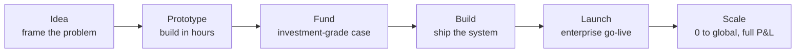

# Cheri Hewlett

### Technology & innovation executive · Builder · CPA · Veteran

   

**I draw the bridge from problem to solution through technology — the right solution for the
problems that return quantifiable value and deliver real impact. Not the newest thing. The thing
that pays.**

### → **[See the work, with the receipts →](https://cherihewlett.dev)**

---

## The record

| 6,916 | 1,725 | 302 | 131 | 261 | 4 |
|:--:|:--:|:--:|:--:|:--:|:--:|
| commits **written** | PRs **shipped** | reusable **capabilities** | live **services** | governed **migrations** | **production** systems |

Every number is recomputed from private production repositories on each build — never typed in.
Authored commits exclude 11,954 automated sync and merge commits; counting those
would inflate the figure ~2.3×. The [collector that produces these numbers](https://github.com/cherihewlett-crypto/cheri-hewlett-cv-showcase/blob/main/scripts/collect-proof.mjs) is public
even though its inputs are not.

## My moat — four capabilities, rarely in one person

Turning a problem into a solution that returns value takes four things most teams split across four
people. Most candidates bring two.

## Idea to scale — I've operated at every stage

The rare part of a 0-to-1 leader is having actually done every stage, not one or two.

## What I'm building

- **Team Echo** — a multi-agent operating system: registry-driven routing, persistent memory, fail-closed authority, and a verifier that recomputes status from live evidence rather than trusting it.
- **Innovation Hub** — a portfolio cockpit for prototype due diligence and roadmap prioritization: evidence-based go/kill decisions, not whoever is loudest in the room.
- **Deterministic rules engine** — a computation engine for regulated, high-stakes numbers: the model plans, deterministic code computes, every figure traceable to source.
- **Citable rules corpus** — atomic domain rules with source-grade citability, re-verifiable by an expert who does not trust the model.

## Selected work — products and functions

Shown as a product where the whole thing is the deliverable, and as a reusable function where the
capability stands on its own. Anonymized — real systems, client identifiers removed.

| Kind | Deliverable | Where it lands |
|---|---|---|
| **Product** | Autonomous business-case engine — idea to a funded, compliance-cleared, safety-tested case | Private Equity · Financial Services · Due Diligence |
| **Product** | Acquisition integration & portfolio unification — absorb M&A fast, one seamless experience | Private Equity · M&A · Enterprise SaaS |
| **Function** | Governed agentic overlay — put audited AI over any legacy system of record, no rebuild | Legacy Modernization · AI Governance |
| **Product** | heyEcho — a multi-agent operating system (this site runs on it) | AI Platform · Agentic Systems |
| **Function** | Truthful verification — recompute "done" from evidence, not self-report | Compliance · Audit · AI Governance |
| **Function** | Domain-doctrine routing — route any question to the exact citable rule | Accounting · Regulatory · Compliance |

## Point of view

**Innovation is choosing the right problem.** Most companies solve the wrong problems faster.
**ROI is the problem solved, not the time saved.** **Trust is the real moat** — the question isn't
"can AI do this," it's "can we prove it did it right." And **how you treat people is the strategy.**

## Background

U.S. Air Force — mission first, people always. PwC and Deloitte. Founded a CPA firm from scratch.
Built and managed a rental portfolio over a decade. Strategic advisor to Crux (London) on
product-acquisition integration, and a board member of the G.R.O.W. Foundation. Rose from customer
success to senior executive leadership at a publicly traded fintech. I've seen the product lifecycle
from every seat — implementing, selling, supporting, and betting a company's transformation on the product.

CPA (VA) · M.S. Accounting, Liberty University · B.S. Accounting & Computer Science, University of Maryland · U.S. Air Force Veteran · Los Angeles, CA

## In public

Speaker — BeyondTheBlack (main stage, five consecutive years) · BlackLine Investor Day · SAP Sapphire,
Barcelona · LWT Summit · Product Advisory Collective. Podcast guest — *Sounds Accurate*, *The Go-Live Gap*. Writing on LinkedIn.

## Elsewhere

**[The full showcase →](https://cherihewlett.dev)** · [LinkedIn](https://linkedin.com/in/cheri-hewlett)

---

Generated from the engineering record, not maintained by hand. Recomputed
July 24, 2026.
