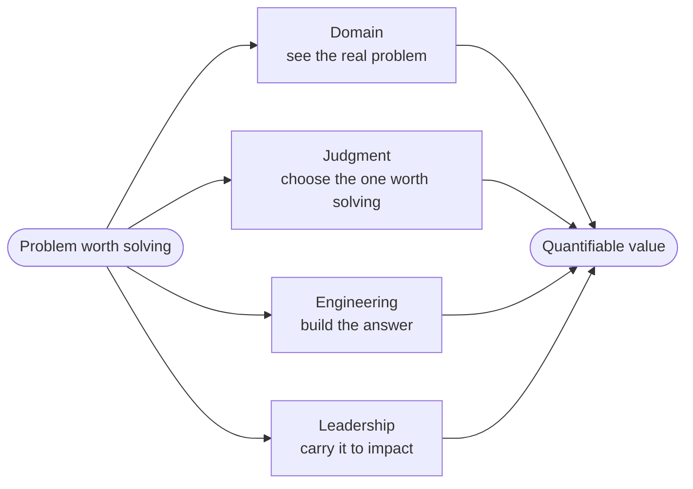
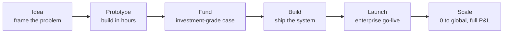

# Cheri Hewlett

### Technology & innovation executive · Builder · CPA · Veteran

   

Turning a problem into a solution that returns value takes four things most teams split across four
people.

## Idea to scale

## Experience — industries, technology

**Industries** · Private Equity · Financial Services · Office of the CFO · Enterprise SaaS · Fund Administration · Accounting & Audit · RegTech · Real Estate

**Technology** · Claude / Anthropic API · Gemini · Vertex AI · Google ADK · RAG & vector memory · Mem0 · MCP tool orchestration · Supabase · PostgreSQL · Next.js · React · TypeScript · Node.js · Deno · Vercel · GitHub Actions · LLM evaluation & governance

## Point of view

**Innovation is choosing the right problem.** Most companies solve the wrong problems faster.
**ROI is the problem solved, not the time saved.** **Trust is the real moat** — the question isn't
"can AI do this," it's "can we prove it did it right." And **how you treat people is the strategy.**

## Background

U.S. Air Force — mission first, people always. PwC and Deloitte. Founded a CPA firm from scratch.
Built and managed a rental portfolio over a decade. Strategic advisor to Crux (London) on
product-acquisition integration, and a board member of the G.R.O.W. Foundation. Rose from customer
success to senior executive leadership at a publicly traded fintech. I've seen the product lifecycle
from every seat — implementing, selling, supporting, and betting a company's transformation on the product.

CPA (VA) · M.S. Accounting, Liberty University · B.S. Accounting & Computer Science, University of Maryland · U.S. Air Force Veteran · Los Angeles, CA

## Elsewhere

 [LinkedIn](https://linkedin.com/in/cheri-hewlett)

